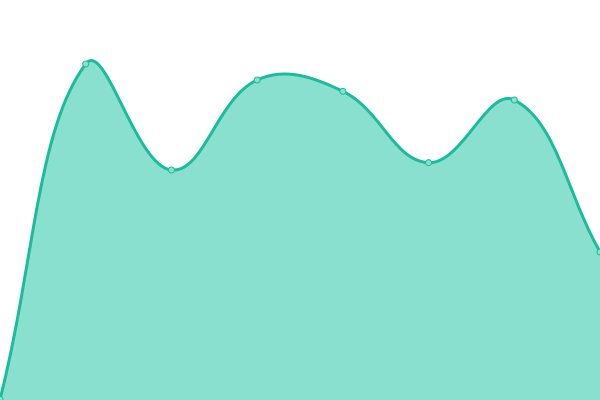
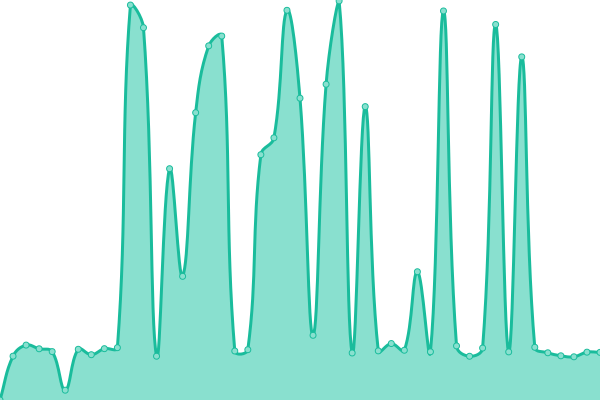

# [📈 Live Status](https://plazi.github.io/monitoring): <!--live status--> **🟩 All systems operational**

This repository contains the open-source uptime monitor and status page for [Plazi](plazi.org), powered by [Upptime](https://github.com/upptime/upptime).

With [Upptime](https://upptime.js.org), you can get your own unlimited and free uptime monitor and status page, powered entirely by a GitHub repository. We use [Issues](https://github.com/plazi/monitoring/issues) as incident reports, [Actions](https://github.com/plazi/monitoring/actions) as uptime monitors, and [Pages](https://plazi.github.io/monitoring) for the status page.

<!--start: status pages-->
<!-- This summary is generated by Upptime (https://github.com/upptime/upptime) -->
<!-- Do not edit this manually, your changes will be overwritten -->
<!-- prettier-ignore -->
| URL | Status | History | Response Time | Uptime |
| --- | ------ | ------- | ------------- | ------ |
|  [Plazi](https://www.plazi.org) | 🟩 Up | [plazi.yml](https://github.com/plazi/monitoring/commits/HEAD/history/plazi.yml) | 

 787ms
     
 | 

<a href="https://plazi.github.io/monitoring/history/plazi">100.00%</a>
    

|  [SynoSpecies](https://synospecies.plazi.org) | 🟩 Up | [syno-species.yml](https://github.com/plazi/monitoring/commits/HEAD/history/syno-species.yml) | 

 391ms
     
 | 

<a href="https://plazi.github.io/monitoring/history/syno-species">100.00%</a>
    

|  [Lindas Kingdoms](https://lindas.admin.ch/query?query=PREFIX%20rdf%3A%20%3Chttp%3A%2F%2Fwww.w3.org%2F1999%2F02%2F22-rdf-syntax-ns%23%3E%0ASELECT%20DISTINCT%20%3Fk%20(SAMPLE(%3Fs1)%20as%20%3Fs)%0AWHERE%20%7B%0A%20%20%3Fs1%20a%20%3Chttp%3A%2F%2Ffilteredpush.org%2Fontologies%2Foa%2FdwcFP%23TaxonName%3E%3B%0A%20%20%3Chttp%3A%2F%2Frs.tdwg.org%2Fdwc%2Fterms%2Fkingdom%3E%20%3Fk.%0A%7D%0AGROUP%20BY%20%3Fk) | 🟩 Up | [lindas-kingdoms.yml](https://github.com/plazi/monitoring/commits/HEAD/history/lindas-kingdoms.yml) | 

 4097ms
     
 | 

<a href="https://plazi.github.io/monitoring/history/lindas-kingdoms">99.66%</a>
    

|  [LD Plazi Kingdoms](https://treatment.ld.plazi.org/sparql?query=PREFIX%20rdf%3A%20%3Chttp%3A%2F%2Fwww.w3.org%2F1999%2F02%2F22-rdf-syntax-ns%23%3E%0ASELECT%20DISTINCT%20%3Fk%20(SAMPLE(%3Fs1)%20as%20%3Fs)%0AWHERE%20%7B%0A%20%20%3Fs1%20a%20%3Chttp%3A%2F%2Ffilteredpush.org%2Fontologies%2Foa%2FdwcFP%23TaxonName%3E%3B%0A%20%20%3Chttp%3A%2F%2Frs.tdwg.org%2Fdwc%2Fterms%2Fkingdom%3E%20%3Fk.%0A%7D%0AGROUP%20BY%20%3Fk) | 🟩 Up | [ld-plazi-kingdoms.yml](https://github.com/plazi/monitoring/commits/HEAD/history/ld-plazi-kingdoms.yml) | 

 6899ms
     
 | 

<a href="https://plazi.github.io/monitoring/history/ld-plazi-kingdoms">100.00%</a>
    

|  [Treatmentbank](https://tb.plazi.org/GgServer/search?fullText.ftQuery=lepus&fullText.matchMode=prefix&taxonomicName.taxonomicName=&taxonomicName.isNomenclature=true&taxonomicName.exactMatch=true&taxonomicName.order=&taxonomicName.family=&taxonomicName.genus=&taxonomicName.species=&BibMetaData.docAuthor=&BibMetaData.docDate=&BibMetaData.docTitle=&BibMetaData.docOrigin=&BibMetaData.part=&BibMetaData.pageNumber=&BibMetaData.extId=&materialsCitation.location=&materialsCitation.country=&materialsCitation.stateProvince=&materialsCitation.typeStatus=All+Types&materialsCitation.collectionCode=&materialsCitation.specimenCode=&materialsCitation.LSID=&materialsCitation.longitude=&materialsCitation.latitude=&materialsCitation.degreeCircle=1&materialsCitation.elevation=&materialsCitation.elevationCircle=100&indexName=0&subIndexName=0&minSubResultSize=0) | 🟩 Up | [treatmentbank.yml](https://github.com/plazi/monitoring/commits/HEAD/history/treatmentbank.yml) | 

 2393ms
     
 | 

<a href="https://plazi.github.io/monitoring/history/treatmentbank">99.66%</a>
    

<!--end: status pages-->

[**Visit our status website →**](https://plazi.github.io/monitoring)

## 📄 License

- Powered by: [Upptime](https://github.com/upptime/upptime)
- Code: [MIT](./LICENSE) © [Plazi](plazi.org)
- Data in the `./history` directory: [Open Database License](https://opendatacommons.org/licenses/odbl/1-0/)
